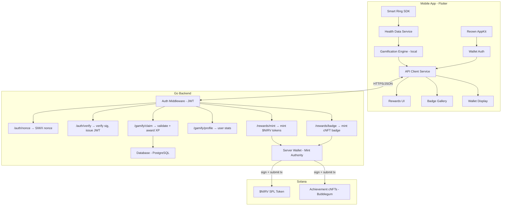
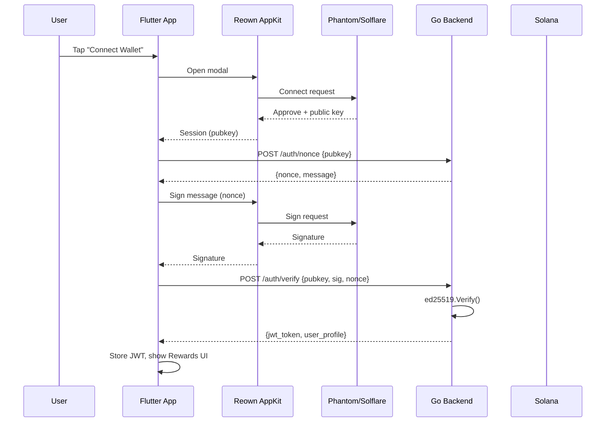

# Solana-Powered Health Gamification for SeekNirvana

Gamify the SeekNirvana smart ring health experience using Solana blockchain. Users authenticate via **Reown AppKit** (Phantom/Solflare wallets), earn **$NIRV tokens** for healthy behaviors, and unlock **achievement NFT badges** — all verified through a **Go backend** that handles auth, XP tracking, and on-chain reward operations.

## User Review Required

> [!IMPORTANT]
> **Token type**: This plan uses a custom SPL token (`$NIRV`). Two options:
> 1. **Transferable token** — users can trade/transfer. Requires legal review.
> 2. **Soulbound / non-transferable** — simpler, purely gamification. No legal risk.
> Recommendation: Start with **soulbound** (Phase 1-3), add transferability later.

> [!IMPORTANT]
> **Go backend hosting**: Where will you host the Go server? Options:
> - VPS (DigitalOcean/Hetzner) — simple, full control
> - Fly.io / Railway — managed deployment
> - Self-hosted on existing infra
> The plan is infrastructure-agnostic but needs a decision before deployment.

> [!WARNING]
> **Network**: All development on **Solana Devnet**. Mainnet deployment requires SOL for transaction fees held by the server mint authority wallet.

## Open Questions

1. **Do you already have a Reown Cloud project?** We need a `PROJECT_ID` from [dashboard.reown.com](https://dashboard.reown.com). If not, we'll create one.
2. **Go backend repository**: Should it live in the same repo (monorepo) or a separate `seeknirvana-server` repo?
3. **Database for backend**: PostgreSQL (recommended) or SQLite for the Go server?
4. **Phase priority**: Build the Go backend + auth first (Phase 1-2), or the gamification UI first (Phase 3) with mock data?

---

## Architecture Overview



### Auth Flow



---

## Proposed Changes

### Phase 1: Go Backend — Auth & Gamification API

> [!NOTE]
> This is a **new Go project** (separate from the Flutter app). Uses `github.com/gagliardetto/solana-go` for Solana interactions and standard `net/http` or `chi` router for the API.

#### [NEW] `server/` (Go project root)

**Directory structure:**
```
server/
├── cmd/server/main.go          # Entry point
├── internal/
│   ├── auth/
│   │   ├── handler.go          # /auth/nonce, /auth/verify endpoints
│   │   ├── jwt.go              # JWT generation + validation
│   │   └── middleware.go       # Auth middleware
│   ├── gamify/
│   │   ├── handler.go          # /gamify/claim, /gamify/profile
│   │   ├── engine.go           # XP calculation, streak logic
│   │   ├── achievements.go     # Achievement catalog + detection
│   │   └── models.go           # User, XPEvent, Achievement structs
│   ├── rewards/
│   │   ├── handler.go          # /rewards/mint, /rewards/badge
│   │   ├── solana.go           # SPL token mint, cNFT mint via Bubblegum
│   │   └── wallet.go           # Server mint authority keypair management
│   ├── db/
│   │   ├── postgres.go         # DB connection + migrations
│   │   └── queries.go          # SQL queries
│   └── config/
│       └── config.go           # Env vars, RPC URL, JWT secret
├── go.mod
├── go.sum
├── Dockerfile
└── README.md
```

**API Endpoints:**

| Method | Path | Auth | Description |
|---|---|---|---|
| `POST` | `/auth/nonce` | None | Generate SIWX nonce for pubkey |
| `POST` | `/auth/verify` | None | Verify ed25519 signature, return JWT |
| `GET` | `/gamify/profile` | JWT | Get user XP, level, streak, achievements |
| `POST` | `/gamify/claim` | JWT | Submit health event (steps, sleep, etc.) for XP |
| `GET` | `/gamify/leaderboard` | JWT | Weekly top users |
| `POST` | `/rewards/mint` | JWT | Claim pending $NIRV token reward |
| `POST` | `/rewards/badge` | JWT | Mint achievement cNFT badge |

**Database schema (PostgreSQL):**
```sql
-- users table
CREATE TABLE users (
    pubkey TEXT PRIMARY KEY,
    total_xp INT DEFAULT 0,
    current_streak INT DEFAULT 0,
    longest_streak INT DEFAULT 0,
    last_active_date DATE,
    created_at TIMESTAMPTZ DEFAULT NOW()
);

-- xp_events table (audit log)
CREATE TABLE xp_events (
    id SERIAL PRIMARY KEY,
    pubkey TEXT REFERENCES users(pubkey),
    event_type TEXT NOT NULL,     -- 'steps', 'sleep', 'meditation', etc.
    base_xp INT NOT NULL,
    multiplier REAL DEFAULT 1.0,
    total_xp INT NOT NULL,
    created_at TIMESTAMPTZ DEFAULT NOW()
);

-- achievements table
CREATE TABLE achievements (
    pubkey TEXT REFERENCES users(pubkey),
    achievement_id TEXT NOT NULL,
    unlocked_at TIMESTAMPTZ DEFAULT NOW(),
    tx_signature TEXT,            -- Solana tx sig for cNFT mint
    PRIMARY KEY (pubkey, achievement_id)
);
```

**Key dependencies (Go):**
- `github.com/gagliardetto/solana-go` — Solana RPC, transaction building, signing
- `github.com/go-chi/chi/v5` — HTTP router
- `github.com/golang-jwt/jwt/v5` — JWT tokens
- `github.com/jackc/pgx/v5` — PostgreSQL driver
- `crypto/ed25519` — signature verification

---

### Phase 2: Reown AppKit Integration (Flutter)

#### [MODIFY] [pubspec.yaml](file:///Users/shachindra/Projects/SeekNirvana/mobile-app/pubspec.yaml)

Add Reown AppKit dependency:
```yaml
reown_appkit: ^1.6.0
```

#### [NEW] [reown_service.dart](file:///Users/shachindra/Projects/SeekNirvana/mobile-app/lib/services/reown_service.dart)

Wrapper around `ReownAppKitModal`:
- Initialize with `PROJECT_ID` (via `--dart-define`)
- Configure for **Solana only** (Mainnet + Devnet)
- Handle wallet connection events
- Sign SIWX messages for authentication
- Expose connected wallet address

#### [NEW] [auth_service.dart](file:///Users/shachindra/Projects/SeekNirvana/mobile-app/lib/services/auth_service.dart)

Backend authentication flow:
- `requestNonce(pubkey)` → calls `POST /auth/nonce`
- `verifySignature(pubkey, sig, nonce)` → calls `POST /auth/verify`, stores JWT
- `logout()` → clear JWT + disconnect wallet
- Auto-refresh JWT on expiry

#### [NEW] [api_client.dart](file:///Users/shachindra/Projects/SeekNirvana/mobile-app/lib/services/api_client.dart)

HTTP client for Go backend:
- Base URL configuration (dev/prod)
- JWT header injection
- All gamification + rewards API calls
- Error handling + retry logic

#### [NEW] [wallet_provider.dart](file:///Users/shachindra/Projects/SeekNirvana/mobile-app/lib/providers/wallet_provider.dart)

Riverpod state for wallet/auth:
- `walletAddressProvider` — connected Solana pubkey (base58)
- `isAuthenticatedProvider` — JWT valid
- `authTokenProvider` — current JWT

#### Native configuration required:

**iOS** (`ios/Runner/Info.plist`):
- Add `LSApplicationQueriesSchemes`: `phantom`, `solflare`
- Configure URL scheme for deep link return

**Android** (`android/app/src/main/AndroidManifest.xml`):
- Add `<queries>`: `app.phantom`, `com.solflare.mobile`

**Both platforms**: Deep link handler for Phantom Link Mode (EventChannel pattern from Reown docs)

---

### Phase 3: Gamification Engine + Rewards UI (Flutter)

> [!NOTE]
> The local gamification engine files created earlier (`gamification_engine.dart`, `gamification_store.dart`, `gamification_provider.dart`, `achievements.dart`) remain as the **offline-first layer**. They track XP locally and sync to the backend when connected.

#### [NEW] [rewards_screen.dart](file:///Users/shachindra/Projects/SeekNirvana/mobile-app/lib/features/rewards/rewards_screen.dart)

Main rewards hub — new tab in bottom navigation:

1. **Level Hero Card** — level name/emoji, XP progress ring, streak fire counter, multiplier badge
2. **Daily Quests** — today's earnable XP actions with progress indicators
3. **Achievement Gallery** — grid of badges (locked = grayscale, unlocked = colored with glow)
4. **$NIRV Balance** — token balance from on-chain query
5. **Connect Wallet CTA** — Reown AppKit connect button (if not authenticated)

#### [MODIFY] [app_router.dart](file:///Users/shachindra/Projects/SeekNirvana/mobile-app/lib/core/router/app_router.dart)

Add `/rewards` route to ShellRoute.

#### [MODIFY] [app_scaffold.dart](file:///Users/shachindra/Projects/SeekNirvana/mobile-app/lib/shared/widgets/app_scaffold.dart)

Add "Rewards" tab (trophy icon) to bottom navigation bar.

#### [MODIFY] [home_screen.dart](file:///Users/shachindra/Projects/SeekNirvana/mobile-app/lib/features/home/home_screen.dart)

Add compact gamification card:
- Current streak + fire emoji
- Today's XP earned
- Next achievement progress

---

### Phase 4: On-Chain Token & NFT Minting (Go Backend)

#### Server-side Solana operations in `internal/rewards/`

**$NIRV Token Minting:**
- Server holds mint authority keypair (loaded from env/secret)
- On `/rewards/mint` call: constructs `MintTo` instruction → signs → submits to Solana
- User's wallet address is the token recipient
- Rate limited: max 1 claim per day per user

**Achievement cNFT Minting:**
- Uses Metaplex Bubblegum program for compressed NFTs
- Each achievement has pre-uploaded metadata (name, image, description) on Arweave/IPFS
- On `/rewards/badge` call: constructs Bubblegum `MintV1` instruction → signs → submits
- Stores tx signature in `achievements` table

---

### Phase 5: Wallet & Badge Gallery UI (Flutter)

#### [NEW] [wallet_screen.dart](file:///Users/shachindra/Projects/SeekNirvana/mobile-app/lib/features/rewards/wallet_screen.dart)

- Wallet address (copyable + QR code)
- $NIRV token balance
- SOL balance
- Claim history (from backend API)
- Disconnect wallet button

#### [NEW] [badge_gallery_screen.dart](file:///Users/shachindra/Projects/SeekNirvana/mobile-app/lib/features/rewards/badge_gallery_screen.dart)

- Fetch owned cNFTs via Helius DAS API (`getAssetsByOwner`)
- Badge cards: image, name, rarity glow, date earned
- Locked badges: silhouette + progress bar
- Share badge (uses existing `share_plus`)

#### [MODIFY] [profile_screen.dart](file:///Users/shachindra/Projects/SeekNirvana/mobile-app/lib/features/profile/profile_screen.dart)

Add "Wallet & Rewards" section card:
- Wallet address (truncated)
- $NIRV balance
- Achievement count
- Link to wallet screen

---

## XP Reward Table

| Health Action | Base XP | Conditions |
|---|---|---|
| Step goal reached | 50 | ≥100% of daily step goal |
| Sleep score ≥ 80 | 40 | Quality sleep night |
| Deep sleep ≥ 90 min | 25 | Restorative sleep bonus |
| Meditation completed | 30 | Any activity session |
| Healthy resting HR | 15 | HR 60–100 BPM |
| SpO2 ≥ 95% | 10 | Healthy oxygen level |
| Daily check-in | 5 | Once per day |

**Streak multipliers:** 3-day → 1.5×, 7-day → 2×, 14-day → 2.5×, 30-day → 3×

---

## File Summary

| Phase | File | Type | Location |
|---|---|---|---|
| 1 | `server/` (full Go project) | NEW | Separate repo/directory |
| 2 | `services/reown_service.dart` | NEW | Flutter app |
| 2 | `services/auth_service.dart` | NEW | Flutter app |
| 2 | `services/api_client.dart` | NEW | Flutter app |
| 2 | `providers/wallet_provider.dart` | NEW | Flutter app |
| 2 | `pubspec.yaml` | MODIFY | Add `reown_appkit` |
| 2 | iOS `Info.plist` | MODIFY | Wallet detection schemes |
| 2 | Android `AndroidManifest.xml` | MODIFY | Wallet query packages |
| 3 | `services/gamification_engine.dart` | EXISTS | Already created |
| 3 | `services/gamification_store.dart` | EXISTS | Already created |
| 3 | `providers/gamification_provider.dart` | EXISTS | Already created |
| 3 | `core/constants/achievements.dart` | EXISTS | Already created |
| 3 | `features/rewards/rewards_screen.dart` | NEW | Flutter app |
| 3 | `core/router/app_router.dart` | MODIFY | Add `/rewards` route |
| 3 | `shared/widgets/app_scaffold.dart` | MODIFY | Add Rewards tab |
| 3 | `features/home/home_screen.dart` | MODIFY | Add gamification card |
| 4 | `internal/rewards/solana.go` | NEW | Go backend |
| 5 | `features/rewards/wallet_screen.dart` | NEW | Flutter app |
| 5 | `features/rewards/badge_gallery_screen.dart` | NEW | Flutter app |
| 5 | `features/profile/profile_screen.dart` | MODIFY | Add wallet section |

---

## Verification Plan

### Phase 1 (Go Backend)
```bash
cd server && go test ./...
# Start server locally
go run cmd/server/main.go
# Test auth flow with curl
curl -X POST localhost:8080/auth/nonce -d '{"pubkey":"..."}'
```

### Phase 2 (Reown Integration)
- Verify Phantom wallet detection on iOS + Android
- Test full SIWX auth flow (connect → sign → JWT)
- Verify JWT persists across app restarts

### Phase 3 (Gamification UI)
- `flutter analyze` passes
- Widget renders correctly on multiple screen sizes
- XP awards correctly on health events
- Streak multiplier applies

### Phase 4-5 (On-chain + UI)
- Devnet token mint succeeds (verify on Solana Explorer)
- cNFT badge appears in badge gallery
- End-to-end: connect wallet → earn XP → claim tokens → view in wallet

### Build Verification
```bash
cd /Users/shachindra/Projects/SeekNirvana/mobile-app
flutter analyze
flutter build ios --debug
flutter build apk --debug
```
